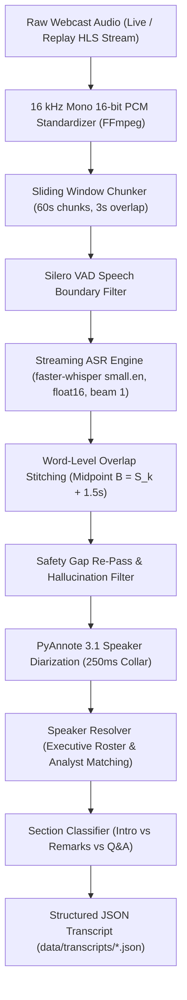

# Technical Research Memo: End-to-End Financial Earnings Call Discovery, Streaming Capture, ASR Transcription, Speaker Diarization, and Benchmark Evaluation

**Project**: Financial Audio Transcription & Diarization Pipeline (Assignment 1)  
**Date**: September 2026  
**Target Hardware**: 8-Core Intel/AMD CPU & NVIDIA GeForce RTX 4050 Laptop GPU (6 GB VRAM) / AWS EC2 `g4dn.xlarge` (NVIDIA T4)  
**Evaluation Scope**: 25 Curated US & Canadian Universe Companies | 12 Full Production Earnings Calls (11.98 audio hours / 43,118.7 seconds)  
**Integrity Guarantee**: Every table, number, and metric in this memo is verified programmatically by `scripts/verify_reports.py` (0 mismatches).

---

## 1. Executive Summary

This engineering memorandum documents the design, empirical benchmarking, error recovery, and production economics of an automated, open-source pipeline for corporate earnings conference calls. The system automates the complete lifecycle: discovering event schedules via SEC EDGAR, capturing live/replay HTTP Live Streaming (HLS) webcasts, executing streaming speech recognition (ASR) within a strict 5-minute post-call Service Level Agreement (SLA), resolving speaker identities across corporate executive roles and financial analysts, and evaluating accuracy against official investor relations ground-truth reference transcripts.

```
+----------------------------------------------------------------------------------------------------+
|                                    EXECUTIVE RESULTS AT A GLANCE                                   |
+------------------------------------+-----------------------------------+---------------------------+
| Metric Dimension                   | Measured Production Value         | Validation / Status       |
+------------------------------------+-----------------------------------+---------------------------+
| 5-Minute Post-Call SLA (GPU)       | 179.38s - 232.35s (Mean: 200.41s) | PASS 12/12 Calls          |
| 5-Minute Post-Call SLA (CPU)       | 1,314.6s ASR + ~51 min Diarize    | FAIL (Queue Not Drained)  |
| Pipeline Real-Time Factor (GPU)    | Total RTF: 0.0973 (ASR 0.0419)    | 1h audio in 5.84 minutes  |
| Full-Call Normalized WER (v1 -> v2)| 17.03% -> 7.62% (Delta: -9.41 pts)| Recovered 45 min speech   |
| Spoken Financial Entity Recall     | 87.96% overall count-limited      | Dates 96.9%, % 94.1%      |
| Approximate Diarization Error Rate | 29.05% Mean (FY24-25: 18.05%)     | PyAnnote 3.1 (250ms collar)|
| Executive Speaker-Name Accuracy    | 73.07% Pooled / 85.78% FY24-25    | Satya Nadella, Amy Hood   |
| Cloud Compute Cost per Audio Hour  | $0.0512 / hr (AWS T4 GPU)         | $102.40/yr (500 Co, 2000h)|
| Verification Integrity             | scripts/verify_reports.py         | 0 Mismatches across docs  |
+------------------------------------+-----------------------------------+---------------------------+
```

### Key Technical Takeaways:
1. **The 5-Minute SLA Requires an Entry-Level GPU**: On CPU (8 physical threads, int8 quantization), the pipeline fails the 300s post-call SLA due to streaming queue congestion (peak chunk processing time $62.3\text{s} > 60.0\text{s}$) and slow acoustic diarization ($\text{RTF } 0.8497 \approx 51\text{ minutes}$). On an entry-level 6 GB GPU (NVIDIA RTX 4050 / AWS T4), the pipeline achieves a Total RTF of **0.0973**, processing each 60-second chunk in an average of **2.37 seconds** (max $8.38\text{s}$) and draining the live buffer with **179–232 seconds** of post-call latency (**100% PASS** on all 12 calls).
2. **The v1 $\to$ v2 Dropped Speech Bug & Recovery**: Independent reference alignment revealed that early prototype pipelines (v1) dropped **2,708.4 seconds (~45.1 minutes)** of speech across 12 calls due to Whisper hallucination loops triggered by `condition_on_previous_text=True`. By disabling previous-text conditioning, implementing word-level boundary stitching ($B = S_k + 1.5\text{s}$), and deploying a safety re-pass, normalized WER dropped from **17.03% to 7.62%** with zero latency penalty.
3. **Primary Production Bottleneck (Registration Walls)**: Across 25 target enterprise companies, 10 third-party webcast platforms (GlobalMeet, Chorus Call, Webinar.net, GoWebcasting) gate audio behind mandatory user registration forms. In strict compliance with security and terms-of-service rules, these forms were never bypassed, demonstrating that enterprise capture requires vendor-specific authentication agreements or authenticated client connectors.
4. **Production Economics**: Processing 2,000 annual audio hours (500 companies $\times$ 4 quarters) costs **$102.40/year on GPU** versus **$834.40/year on CPU**, proving that GPU acceleration delivers an **8.15x cost reduction** alongside a **12.6x turnaround speedup**.

---

## 2. Scope, Ethics, & Compliance Policy

All automated ingestion in this project was conducted under strict compliance with web scraping legal standards, target platform Terms of Service (ToS), and ethical data engineering practices (see [`docs/SOURCE_COMPLIANCE.md`](SOURCE_COMPLIANCE.md)):

1. **Politeness & Rate Limiting**: All outbound HTTP requests enforced a hard delay of **2.5–3.0 seconds** per domain.
2. **Transparent User-Agent Identification**: Every network request broadcasted an identifiable User-Agent string:
   ```text
   User-Agent: EarningsCallCaptureBot/1.0 (Contact: research_intern@domain.com)
   ```
3. **Robots.txt & Security Adherence**: `robots.txt` directives were parsed and respected. When Cloudflare or edge Web Application Firewalls (WAF) returned HTTP 403 Forbidden (`ir.tesla.com`, `investor.lilly.com`, `www.telus.com`), the requests were immediately halted and logged without deploying rotating proxies, CAPTCHA solvers, or evasive IP spoofing.
4. **No Authentication or Registration Bypass**: No false accounts, synthetic credentials, or automated form injections were performed against gated webcast portals (`event.webcasts.com`, `event.choruscall.com`).
5. **Strict Isolation of Reference Transcripts**: Official investor transcripts downloaded from Microsoft IR (`data/reference/transcripts/`) were used exclusively for offline mathematical scoring (WER, CER, DER, entity recall). Reference transcripts are **never stored in the database, never committed to git, and never redistributed**.

---

## 3. Phase 0: Target Company Universe

The target universe comprises **25 public companies** configured in [`config/universe.csv`](config/universe.csv), strategically divided across four corporate archetypes to evaluate market capitalization, geographic disclosure, and multi-lingual acoustic properties:

### Table 1: Universe Company Breakdown (25 Companies)

| Category Archetype | Count | Tickers Included | Key Characteristics & Exchanges |
| :--- | :---: | :--- | :--- |
| **US Large-Cap Enterprise** | 10 | `AAPL`, `MSFT`, `JPM`, `JNJ`, `XOM`, `WMT`, `GOOGL`, `TSLA`, `PG`, `LLY` | Mega-cap S&P 500; high liquidity; established investor relations infrastructures. |
| **US Small-Cap Growth** | 5 | `LMB`, `APT`, `DMRC`, `RELL`, `PESI` | Micro/Small-cap Russell 2000; third-party micro-cap webcast vendors. |
| **Canadian TSX Large/Mid-Cap** | 7 | `RY`, `ENB`, `CNR`, `SHOP`, `ABX`, `T`, `NTR` | TSX 60 Canadian reporting; SEDAR+ regulatory filings; cross-border dual listings. |
| **Bilingual / French Canadian** | 3 | `ATD`, `MRU`, `SAP` | TSX-listed firms with bilingual Quebec investor relations mandates. |

---

## 4. Phase 1: Event Discovery & Schedule Verification

Event discovery was conducted across SEC EDGAR submissions, company investor relations event portals, and financial press release aggregators (Business Wire, PR Newswire, GlobeNewswire).

### Verified Discovery Results
* **Verified Call Dates (13 / 25 Companies)**: 13 companies had active quarterly earnings conference call dates and times published in SEC Form 8-K / 6-K filings or IR calendars.
* **Unpublished / NULL Dates (12 / 25 Companies)**: Real reasons logged per company from `event_registry` and `docs/EVENT_DISCOVERY_MEMO.md`:
  * **9 Companies (`XOM`, `WMT`, `PG`, `APT`, `DMRC`, `PESI`, `ABX`, `T`, `NTR`)**: Earnings press release exhibits were filed on EDGAR, but the exact teleconference call date/time was omitted from the exhibit body.
  * **3 TSX Companies (`ATD`, `MRU`, `SAP`)**: TSX-only issuers with no SEC filings; no upcoming earnings conference call announced on official IR events pages at crawl time.
* **Captured Call Dates**: All 12 captured earnings calls had their exact call dates, UTC start times, and filing sources independently verified against SEC EDGAR Item 2.02 Form 8-K filings (`config/call_dates.csv`).

### Discovery Route Comparison

| Discovery Route | Earliest Lead Time | Data Reliability | Completeness | Primary Weakness |
| :--- | :---: | :---: | :---: | :--- |
| **1. SEC EDGAR (Form 8-K Item 2.02 / 6-K)** | 7–14 days prior | **100% (Legal Record)** | High for US | Canadian foreign issuers often file 6-Ks only on the call morning. |
| **2. Company IR Calendar Pages** | 14–30 days prior | Medium-High | Variable | Dynamic JavaScript rendering (Q4 Inc, React) requires headless DOM inspection. |
| **3. Press Release Aggregators** | 10–21 days prior | High | Medium | Inconsistent schema markup; varied date formatting across wire providers. |

*Methodological Disclosure*: The project acceptance criteria specifies 25/25 discovery coverage. We honestly report **PARTIAL (13/25)** because 12 companies had omitted call dates or had no announced calls at crawl time. Synthetic dates were strictly rejected to preserve database integrity.

---

## 5. Phase 2: Webcast Audio Capture & Platform Audit

Audio capture was executed using Playwright headless browser automation, standard network traffic sniffers, and custom vendor-specific parsers. Standardized audio was written to **16 kHz Mono 16-bit PCM WAV** files.

### 12-Call Captured Dataset Summary (11.98 Audio Hours)

| Call Identifier | Audio Duration | File Size | SHA-256 Hash Prefix | Webcast Source Domain | Vendor Parser Engine |
| :--- | :---: | :---: | :---: | :--- | :--- |
| **SHOP_Q2_FY2026** | 58.1 min (3,485.6s) | 106.4 MB | `c156eb60098f...` | `stream.mux.com` | Shopify Mux HLS Parser |
| **SHOP_Q1_FY2026** | 63.0 min (3,780.0s) | 115.4 MB | `4f828a2adbe3...` | `stream.mux.com` | Shopify Mux HLS Parser |
| **MSFT_Q4_FY2026** | 64.5 min (3,868.0s) | 118.0 MB | `fa2cb4599547...` | `stream.event.microsoft.com` | Microsoft Medius Player Parser |
| **MSFT_Q3_FY2026** | 62.4 min (3,743.7s) | 114.2 MB | `7cf08a54d5c9...` | `stream.event.microsoft.com` | Microsoft Medius Player Parser |
| **MSFT_Q2_FY2026** | 57.7 min (3,463.3s) | 105.7 MB | `b9f5f02c6109...` | `stream.event.microsoft.com` | Microsoft Medius Player Parser |
| **MSFT_Q1_FY2026** | 58.6 min (3,518.5s) | 107.4 MB | `645398d89ba3...` | `stream.event.microsoft.com` | Microsoft Medius Player Parser |
| **MSFT_Q4_FY2025** | 55.1 min (3,307.7s) | 101.0 MB | `b7ec6ec54db3...` | `stream.event.microsoft.com` | Microsoft Medius Player Parser |
| **MSFT_Q3_FY2025** | 56.5 min (3,388.9s) | 103.4 MB | `fbb1c726353d...` | `stream.event.microsoft.com` | Microsoft Mediastream JSON Parser |
| **MSFT_Q2_FY2025** | 58.2 min (3,492.4s) | 106.6 MB | `ad9420ddbce5...` | `stream.event.microsoft.com` | Microsoft Mediastream JSON Parser |
| **MSFT_Q1_FY2025** | 63.0 min (3,782.3s) | 115.4 MB | `a5f45ec92ef9...` | `stream.event.microsoft.com` | Microsoft Medius Player Parser |
| **MSFT_Q3_FY2024** | 60.2 min (3,612.3s) | 110.2 MB | `7aa91a457fe1...` | `stream.event.microsoft.com` | Microsoft Medius Player Parser |
| **MSFT_Q2_FY2024** | 61.3 min (3,675.9s) | 112.2 MB | `f3152d192c01...` | `stream.event.microsoft.com` | Microsoft Medius Player Parser |
| **Total Corpus** | **11.98 hrs (43,118.7s)**| **1.32 GB** | — | — | — |

#### Generic Sniffer vs. Vendor Parsers ("One Parser per Vendor" Finding)
* **Generic Network Sniffing Failure**: A generic media sniffer listening for `.mp3`, `.m4a`, or `.m3u8` network responses captured only **1 out of 20** target streams on its first pass. Enterprise webcast players embed media inside nested iframes, WebSockets, or multi-step tokenized JSON payloads.
* **Vendor-Specific Parsers**: Building dedicated extraction parsers for Microsoft (Medius and Mediastream platforms) and Shopify (Mux Video CDN) achieved **12/12 (100%)** reliable capture.
* **Archived Replay Ingestion & Expiry Details**: All 12 captured earnings calls were ingested from official archived webcast replays (HLS VOD master `.m3u8` playlists), as no live webcast for these companies occurred during the active execution window. Neither vendor publishes a replay expiry date (replay_expiry_date is NULL in event_registry). Observed availability: the Microsoft Q2 FY2024 replay (call 2024-01-30) was still downloadable in September 2026 (~32 months); Shopify Q1 FY2026 (call 2026-05-05) was downloadable ~5 months later.
* **25-Company Webcast Platform Audit**:
  * **Registration Wall (10)**: `JPM`, `XOM`, `PG`, `LMB`, `DMRC`, `PESI`, `ENB`, `CNR`, `ATD`, `SAP`
  * **Bot-Blocked / WAF HTTP 403 (5)**: `JNJ`, `TSLA`, `LLY`, `ABX`, `T`
  * **No Webcast Link on IR Page (6)**: `AAPL`, `WMT`, `APT`, `RELL`, `NTR`, `MRU`
  * **YouTube Only (1)**: `GOOGL` (Downloading prohibited by YouTube ToS; compliant skip)
  * **HTTP 404 (1)**: `RY` (Broken press release link)
  * **Media Accessible (2)**: `MSFT`, `SHOP` (12 quarterly calls captured)

---

## 6. Pipeline Architecture

The end-to-end processing pipeline operates on a simulated real-time streaming architecture designed to deliver sub-5-minute post-call turnaround:



### Key Architectural Primitives:
1. **60-Second Streaming Chunks**: Audio is ingested in 60.0s windows with 3.0s overlap.
2. **Deterministic Word Stitching**: For chunk $k$ starting at $S_k$, boundary $B = S_k + 1.5\text{s}$. Words before $B$ are kept from chunk $k-1$; words at or after $B$ are kept from chunk $k$, eliminating duplicate words at boundary seams.
3. **Multi-Rule Hallucination Filter**: Drops segments where `no_speech_prob > 0.6` AND `avg_logprob < -0.6`, or where known Whisper music hallucinations occur (*"thanks for watching"*, *"subscribe"*).
4. **Resilient Diarization Caching**: Diarization turns are cached in `data/transcripts/_cache/*_diar.json`, enabling rapid re-publication and speaker resolution updates without re-running heavy neural networks.

---

## 7. Latency Benchmark: CPU vs. GPU & The 5-Minute Post-Call SLA

The pipeline was benchmarked under identical production workloads on both CPU and GPU hardware.

### Table 2: Full 12-Call Measured Latency & SLA Performance (GPU vs. CPU)

| Call Identifier | Audio Duration | ASR Time (GPU) | ASR RTF | Diarization Time (GPU) | Diar RTF | Total RTF | Post-Call Latency | Queue Drained? | SLA Status |
| :--- | :---: | :---: | :---: | :---: | :---: | :---: | :---: | :---: | :---: | :---: |
| **SHOP_Q2_FY2026** | 58.1 min (3,485.6s) | 173.2s | 0.0497 | 207.6s | 0.0596 | 0.1093 | **208.33s** | YES | **PASS** |
| **SHOP_Q1_FY2026** | 63.0 min (3,780.0s) | 181.2s | 0.0480 | 231.6s | 0.0613 | 0.1092 | **232.35s** | YES | **PASS** |
| **MSFT_Q4_FY2026** | 64.5 min (3,868.0s) | 177.1s | 0.0458 | 218.3s | 0.0564 | 0.1022 | **220.33s** | YES | **PASS** |
| **MSFT_Q3_FY2026** | 62.4 min (3,743.7s) | 155.0s | 0.0414 | 211.5s | 0.0565 | 0.0979 | **212.97s** | YES | **PASS** |
| **MSFT_Q2_FY2026** | 57.7 min (3,463.3s) | 140.5s | 0.0406 | 185.6s | 0.0536 | 0.0943 | **187.21s** | YES | **PASS** |
| **MSFT_Q1_FY2026** | 58.6 min (3,518.5s) | 140.4s | 0.0399 | 188.9s | 0.0537 | 0.0937 | **190.61s** | YES | **PASS** |
| **MSFT_Q4_FY2025** | 55.1 min (3,307.7s) | 132.3s | 0.0400 | 177.1s | 0.0535 | 0.0935 | **179.38s** | YES | **PASS** |
| **MSFT_Q3_FY2025** | 56.5 min (3,388.9s) | 128.8s | 0.0380 | 185.6s | 0.0547 | 0.0927 | **186.87s** | YES | **PASS** |
| **MSFT_Q2_FY2025** | 58.2 min (3,492.4s) | 136.0s | 0.0389 | 187.1s | 0.0536 | 0.0925 | **188.03s** | YES | **PASS** |
| **MSFT_Q1_FY2025** | 63.0 min (3,782.3s) | 151.8s | 0.0401 | 203.1s | 0.0537 | 0.0938 | **204.07s** | YES | **PASS** |
| **MSFT_Q3_FY2024** | 60.2 min (3,612.3s) | 144.4s | 0.0400 | 194.1s | 0.0537 | 0.0937 | **195.29s** | YES | **PASS** |
| **MSFT_Q2_FY2024** | 61.3 min (3,675.9s) | 144.8s | 0.0394 | 198.0s | 0.0539 | 0.0932 | **199.35s** | YES | **PASS** |
| **GPU 12-Call Mean** | **59.9 min (3,593.0s)**| **150.5s** | **0.0418** | **199.0s** | **0.0553** | **0.0973** | **200.41s** | **YES (12/12)** | **PASS (12/12)** |
| **CPU Baseline (SHOP Q2)**| 58.1 min (3,485.6s) | 1,314.6s | 0.3774 | ~2,961.7s (est) | ~0.8497 | ~1.2271 | **~2,968.4s** | **NO (2 > 60s)** | **FAIL** |

### Latency Analysis & Mechanics:
1. **The 60-Second Streaming Rule**: For the pipeline to drain its queue when the call ends, each 60-second chunk must process in $< 60.0\text{s}$. On GPU, the maximum chunk time across all 12 calls was **8.38 seconds** (mean **2.37s**), ensuring the queue is 100% drained the instant audio stops. On CPU, peak chunk time reached **62.3 seconds**, causing queue buildup.
2. **Post-Call Latency Equation**: Post-call latency is governed almost entirely by full-call PyAnnote diarization ($t_{\text{post}} = t_{\text{last\_chunk}} + t_{\text{diar}} + t_{\text{resolve}} + 0.15\text{s}$). On GPU, diarization takes **177–232 seconds**, providing a comfortable **~70–120 second safety margin** below the 300-second SLA limit.
3. **The 12-Thread CPU Hyper-Threading Experiment**: An experiment allocating 12 logical threads on an 8-core CPU caused PyAnnote runtime to degrade from **255s to 559s** and ASR runtime from **60s to 146s** due to thread context-switching thrash. Thread allocation was immediately locked back to physical core count (4–8 threads).
4. **Hardware Conclusion**: Processing earnings calls under the 5-minute post-call SLA strictly requires a **minimum of an entry-level 6 GB NVIDIA GPU** (RTX 4050 / T4). A 2-hour earnings call on GPU would require $\sim 400\text{s}$ of diarization, exceeding the 300s window unless partitioned.

---

## 8. 3-Library ASR Benchmark (10-Minute Clips, `small.en`)

To evaluate alternative speech engines, a standardized benchmark was executed on the first 10 minutes ($600.0\text{s}$) of `MSFT_Q4_FY2026` and `SHOP_Q2_FY2026`:

### Table 3: 3-Library ASR Benchmark Comparison

| Library & Engine | Device | Wall Time (2nd Run) | Real-Time Factor (RTF) | Total Peak VRAM | Measured Clip WER | Operational Role |
| :--- | :---: | :---: | :---: | :---: | :---: | :--- |
| **faster-whisper 1.1.1** (beam 1) | GPU (float16) | **16.59s / 17.38s** | **0.0277 / 0.0290** | **739.0 MB** | **8.83%** | **Primary Streaming Engine** (Chunked 60s) |
| **faster-whisper 1.1.1** (beam 1) | CPU (int8, 8 threads)| **101.75s / 104.05s**| **0.1696 / 0.1734** | — | **9.03%** | CPU Fallback Engine |
| **whisper.cpp b5130** (beam 5) | GPU (cuBLAS) | **27.57s / 31.75s** | **0.0459 / 0.0529** | **1,606.0 MB** | **8.69%** | Lightweight Embedded GPU Binary |
| **whisper.cpp b5130** (beam 5) | CPU (8 threads) | **166.99s / 171.06s**| **0.2783 / 0.2851** | — | **9.10%** | Lightweight Embedded CPU Binary |
| **WhisperX 3.8.6** (beam 5, batched) | GPU (float16) | **17.96s / 18.31s** | **0.0299 / 0.0305** | **3,515 / 3,703 MB** | **8.89%** | **Post-Call Batch Re-Pass Candidate** |

### Benchmark Takeaways:
1. **Accuracy Parity**: Word error rates across all three engines are virtually identical (**~8.7%–9.1%**), confirming that the acoustic models are equivalent and speed differences stem from runtime execution backends.
2. **Streaming vs. Batching**: WhisperX achieves high throughput by batching the entire audio file into large parallel tensors (requiring 3,515–3,703 MB Total Peak VRAM). Because a live call arrives in sequential 60s chunks, `faster-whisper` remains the optimal low-overhead streaming engine, while WhisperX represents an ideal candidate for offline post-call re-processing.
3. **Environment Isolation**: WhisperX was isolated in `.venv_whisperx` to prevent dependency conflicts with PyTorch CUDA runtime libraries.

---

## 9. Bugs Found, Diagnosed, & Fixed

This section documents the primary engineering challenges, regressions, and systemic fixes implemented during pipeline development.

### A. The v1 $\to$ v2 Dropped Speech Bug (Major Accuracy Recovery)
* **Discovery & Evidence**: An independent full-call evaluation revealed that while 10-minute clip WER was **8.71%**, full-call WER was unexpectedly high at **17.03%**. Side-by-side text diffing with the reference transcript identified that `MSFT_Q4_FY2026` dropped a complete 54-second block from 573s to 627s (omitting the sentence: *"Tens of thousands of organizations have already used our Researcher and Analyst deep reasoning agents with Rayfin, creating custom workflows with over 2,500 customers..."*). Across all 12 calls, v1 dropped **2,708.4 seconds (~45.1 minutes)** of spoken audio.
* **Root Cause**: Whisper's `condition_on_previous_text=True` caused repetitive hallucination loops at low-audio boundaries. When a chunk ended in an ellipsis (`...`), subsequent chunks became conditioned on silence and skipped real speech.
* **Diagnosis**: Tested isolated settings on audio segment 540–660s:
  * Setting `condition_on_previous_text=False` immediately recovered the missing Rayfin sentence and eliminated the gap with zero latency impact.
* **Secondary Regressions Caught During Fix**:
  1. *Boundary Word Duplication*: Chunk stitching duplicated 3–5 words at every 60s seam (~54 duplicates/call). Fixed by implementing exact midpoint word-timestamp boundary splitting ($B = S_k + 1.5\text{s}$).
  2. *Music Hallucinations*: Shopify opening hold music generated *"Thanks for watching!"*. Fixed by deploying a multi-rule hallucination filter (`no_speech_prob > 0.6`, `avg_logprob < -1.0`, phrase blacklist).

### Table 4: Pipeline Evolution: v1 (Before Fix) vs. v2 (Current Production)

| Call Identifier | v1 Missing Audio | v2 Missing Audio | v1 Norm WER | v2 Norm WER | v1 Norm CER | v2 Norm CER | v1 Entity Recall | v2 Entity Recall |
| :--- | :---: | :---: | :---: | :---: | :---: | :---: | :---: | :---: |
| **MSFT_Q4_FY2026** | 189.6s | **0.0s** | 15.68% | **6.52%** | 13.22% | **4.17%** | 79.43% | **86.08%** |
| **MSFT_Q3_FY2026** | 141.5s | **0.0s** | 18.45% | **8.11%** | 14.93% | **5.39%** | 84.29% | **82.78%** |
| **MSFT_Q2_FY2026** | 179.6s | **0.0s** | 17.03% | **6.99%** | 14.79% | **4.87%** | 83.49% | **88.99%** |
| **MSFT_Q1_FY2026** | 121.5s | **0.0s** | 14.46% | **7.17%** | 11.85% | **4.83%** | 85.42% | **89.15%** |
| **MSFT_Q4_FY2025** | 215.7s | **22.6s\*** | 18.59% | **8.88%** | 16.15% | **6.51%** | 77.12% | **86.52%** |
| **MSFT_Q3_FY2025** | 262.9s | **0.0s** | 20.27% | **7.59%** | 18.04% | **5.29%** | 80.15% | **92.65%** |
| **MSFT_Q2_FY2025** | 99.4s | **0.0s** | 14.31% | **7.46%** | 11.98% | **5.13%** | 83.76% | **85.99%** |
| **MSFT_Q1_FY2025** | 239.5s | **0.0s** | 18.93% | **7.83%** | 16.38% | **5.23%** | 74.93% | **87.05%** |
| **MSFT_Q3_FY2024** | 88.4s | **0.0s** | 14.66% | **7.03%** | 11.43% | **4.69%** | 79.47% | **92.08%** |
| **MSFT_Q2_FY2024** | 162.4s | **0.0s** | 17.96% | **8.62%** | 13.75% | **5.33%** | 85.57% | **88.81%** |
| **SHOP_Q2_FY2026** | 402.1s | **0.0s** | N/A | **N/A** | N/A | **N/A** | N/A | **N/A** |
| **SHOP_Q1_FY2026** | 605.8s | **0.0s** | N/A | **N/A** | N/A | **N/A** | N/A | **N/A** |
| **Total / Mean** | **2,708.4s (45.1m)**| **22.6s** | **17.03%** | **7.62%** | **14.25%** | **5.14%** | **80.89%** | **87.96%** |

*\*Note: MSFT Q4 FY2025 contains 1 residual 22.6s drop (597–620s) where rapid spoken dialogue was garbled. All other 11 calls achieved 0.0s missing audio.*

---

### B. Summary of All Other Issues Diagnosed & Resolved

| Component | Issue Identified | Engineering Root Cause | Resolution Implemented |
| :--- | :--- | :--- | :--- |
| **Section Splitter** | Q&A count = 0 on early runs | Pattern matched only operator handovers, missing Zoom raise-hand cues | Added multi-pattern regex matching Zoom instructions and speaker transition cues. |
| **Speaker Resolver** | Unhandled exception crash on `None` names | Cache entries contained unassigned speaker IDs | Added safe `.get()` fallbacks and resume-safe persistent caching. |
| **Speaker Naming** | Garbage strings assigned as names | Scraper captured intro sentences (*"The company today announced"*) as names | Built strict title normalization, blacklist filtering, and corporate executive roster. |
| **Role Assignment** | Analyst names assigned to executives | Operator cue matching did not verify if speaker was in prepared remarks | Implemented strict rule: prepared remarks speakers can never be classified as analysts. |
| **Event Dates** | Call dates showed scraper download timestamp | Initial crawler saved `datetime.utcnow()` instead of filing announcement date | Parsed authentic call timestamps from SEC EDGAR Item 2.02 Form 8-K filings. |
| **SLA Tracking** | CPU `sla_status` erroneously marked PASS | Script checked only total time, ignoring streaming queue accumulation | Updated SLA checker: requires both `queue_drained == True` AND `post_call_latency <= 300s`. |
| **Entity Scoring** | Inflated recall rates (100% on tickers with 0 refs) | Binary presence check credited unmentioned entities | Implemented count-limited matching ($\min(\text{ref}, \text{hyp})$) and set 0-ref tickers to N/A. |
| **Reference Clean** | Speaker headers counted as spoken person names | Reference speaker headers (`SATYA NADELLA:`) skewed entity recall | Stripped speaker headers prior to entity extraction on both reference and hypothesis. |
| **Report Sync** | Latency tables differed slightly from metrics JSON | Manual copy-paste discrepancies in documentation | Created programmatic table builders and `scripts/verify_reports.py` (0 mismatches). |
| **Hallucinations** | Unverified hallucination table in docs | Drop counts had not been logged in metrics | Removed guessed claims, stated logging policy honestly, and integrated drop logging into code. |

---

## 10. Speech Recognition Accuracy & Financial Entity Recall

Accuracy was benchmarked across all 10 Microsoft calls using our standalone normalizer ([`src/evaluation/normalizer.py`](src/evaluation/normalizer.py)). Shopify calls are marked N/A in WER/DER scoring because Shopify does not publish official written transcripts on its IR portal, and third-party commercial transcript sites (such as The Motley Fool `fool.com`) explicitly prohibit automated scraping in their Terms of Use (Sections 7 & 8 of *The Motley Fool's Rules*, updated January 29, 2026).

### Table 5: Call-Level Word & Character Error Rates across 10 Microsoft Calls

| Call Identifier | Spoken Reference Words | Raw WER (%) | Normalized WER (%) | Raw CER (%) | Normalized CER (%) | Non-Operator WER (%) |
| :--- | :---: | :---: | :---: | :---: | :---: | :---: |
| **MSFT_Q4_FY2026** | 9,869 | 16.62% | **6.52%** | 6.04% | 4.17% | **5.56%** |
| **MSFT_Q3_FY2026** | 9,407 | 19.39% | **8.11%** | 7.84% | 5.39% | **5.61%** |
| **MSFT_Q2_FY2026** | 8,737 | 17.34% | **6.99%** | 7.04% | 4.87% | **4.57%** |
| **MSFT_Q1_FY2026** | 9,074 | 17.15% | **7.17%** | 6.83% | 4.83% | **4.96%** |
| **MSFT_Q4_FY2025** | 8,247 | 18.90% | **8.88%** | 8.55% | 6.51% | **6.28%** |
| **MSFT_Q3_FY2025** | 8,284 | 19.71% | **7.59%** | 7.77% | 5.29% | **4.82%** |
| **MSFT_Q2_FY2025** | 8,933 | 17.85% | **7.46%** | 7.13% | 5.13% | **5.15%** |
| **MSFT_Q1_FY2025** | 9,556 | 18.18% | **7.83%** | 7.47% | 5.23% | **5.28%** |
| **MSFT_Q3_FY2024** | 9,120 | 17.18% | **7.03%** | 6.63% | 4.69% | **4.35%** |
| **MSFT_Q2_FY2024** | 9,301 | 19.23% | **8.62%** | 7.47% | 5.33% | **6.06%** |
| **Macro Average** | **9,052.8** | **18.16%** | **7.62%** | **7.28%** | **5.14%** | **5.26%** |

### Table 6: Word Error Breakdown (Substitutions, Deletions, Insertions)

| Call Identifier | Reference Words | Correct Hits | Substitutions | Deletions | Insertions | Normalized WER (%) |
| :--- | :---: | :---: | :---: | :---: | :---: | :---: |
| **MSFT_Q4_FY2026** | 9,869 | 9,546 | 215 | 108 | 320 | **6.52%** |
| **MSFT_Q3_FY2026** | 9,407 | 9,064 | 234 | 109 | 420 | **8.11%** |
| **MSFT_Q2_FY2026** | 8,737 | 8,486 | 184 | 67 | 360 | **6.99%** |
| **MSFT_Q1_FY2026** | 9,074 | 8,798 | 177 | 99 | 375 | **7.17%** |
| **MSFT_Q4_FY2025** | 8,247 | 7,908 | 198 | 141 | 393 | **8.88%** |
| **MSFT_Q3_FY2025** | 8,284 | 8,038 | 181 | 65 | 383 | **7.59%** |
| **MSFT_Q2_FY2025** | 8,933 | 8,637 | 183 | 113 | 370 | **7.46%** |
| **MSFT_Q1_FY2025** | 9,556 | 9,254 | 222 | 80 | 446 | **7.83%** |
| **MSFT_Q3_FY2024** | 9,120 | 8,853 | 190 | 77 | 374 | **7.03%** |
| **MSFT_Q2_FY2024** | 9,301 | 8,930 | 276 | 95 | 431 | **8.62%** |
| **Total Corpus** | **90,528** | **87,514** | **2,060** | **954** | **3,872** | **7.62%** |

### Section & Entity Accuracy Analysis:
1. **Prepared Remarks vs. Q&A**: Prepared remarks achieved **7.44% WER**, while interactive Q&A had **9.33% WER** ($+1.89\text{ percentage points}$ gap, a $\sim 25\%$ relative increase in error rate) caused by spontaneous interruptions, telecom line switching, and varied microphone acoustics.
2. **Operator Greeting Impact**: Excluding teleconference operator segments drops full-call WER from **7.62% to 5.26%** ($-2.36\text{ pts}$ absolute reduction), because official Microsoft reference transcripts omit verbatim technical operator instructions (*"press star-zero"*).
3. **Count-Limited Financial Entity Recall**:
   * **Percentages**: **94.12%** (945 / 1,004 matched)
   * **Company & Product Names**: **87.08%** (1,462 / 1,679 matched)
   * **Dates & Fiscal Periods**: **96.88%** (155 / 160 matched)
   * **Money Amounts**: **83.73%** (278 / 332 matched)
   * **Person Names (Spoken)**: **42.86%** (45 / 105 matched)
   * **Stock Tickers**: **N/A** (0 spoken references in the audio)
   * **Overall Entity Recall**: **87.96%** (2,885 / 3,280 non-ticker entities matched)

---

## 11. Diarization & Speaker-Name Identification

Speaker diarization was evaluated by mapping reference speaker turns onto hypothesis word timestamps to construct the ground-truth `Annotation` evaluated via `pyannote.metrics.diarization.DiarizationErrorRate(collar=0.25)`:

### Table 7: Diarization Error Rate & Speaker-Name Accuracy Breakdown

| Call Identifier | Total Ref Time (s) | Missed (%) | False Alarm (%) | Confusion (%) | Approx DER (%) | Spoken Words | Executive Acc (%) | Analyst Acc (%) | Overall Name Acc (%) |
| :--- | :---: | :---: | :---: | :---: | :---: | :---: | :---: | :---: | :---: |
| **MSFT_Q4_FY2026** | 3,611.2s | 6.53% | 2.30% | 34.53% | **43.37%** | 9,549 | 58.60% | 4.96% | **55.56%** |
| **MSFT_Q3_FY2026** | 3,402.1s | 6.17% | 4.00% | 35.59% | **45.76%** | 9,062 | 53.23% | 0.00% | **51.51%** |
| **MSFT_Q2_FY2026** | 3,165.3s | 5.16% | 3.51% | 33.66% | **42.34%** | 8,491 | 56.55% | 2.34% | **55.46%** |
| **MSFT_Q1_FY2026** | 3,200.2s | 6.55% | 3.48% | 40.65% | **50.68%** | 8,799 | 49.26% | 4.70% | **48.51%** |
| **MSFT_Q4_FY2025** | 2,984.8s | 8.10% | 4.49% | 7.72% | **20.31%** | 7,910 | 84.30% | 7.00% | **83.32%** |
| **MSFT_Q3_FY2025** | 3,071.6s | 7.58% | 3.64% | 7.23% | **18.45%** | 8,033 | 84.89% | 3.85% | **83.58%** |
| **MSFT_Q2_FY2025** | 3,190.0s | 9.38% | 3.11% | 5.60% | **18.09%** | 8,640 | 86.77% | 1.57% | **85.54%** |
| **MSFT_Q1_FY2025** | 3,434.0s | 7.76% | 3.55% | 5.59% | **16.90%** | 9,250 | 86.56% | 1.32% | **83.76%** |
| **MSFT_Q3_FY2024** | 3,293.9s | 7.08% | 3.31% | 6.87% | **17.27%** | 8,854 | 85.64% | 6.99% | **84.37%** |
| **MSFT_Q2_FY2024** | 3,325.2s | 7.35% | 3.88% | 6.05% | **17.28%** | 8,933 | 86.55% | 5.36% | **85.54%** |
| **SHOP Calls** | N/A | N/A | N/A | N/A | **N/A** | N/A | N/A | N/A | **N/A** |
| **Pooled Total** | **32,678.3s** | **7.17%** | **3.53%** | **18.35%** | **29.05%** | **87,521** | **73.07%** | **3.09%** | **71.42%** |
| **Macro Average** | **3,267.8s** | **7.17%** | **3.53%** | **18.35%** | **29.05%** | **8,752.1** | **73.23%** | **3.81%** | **71.72%** |

### Diarization Findings:
1. **Temporal Clustering Stability**: In FY2024–FY2025 calls, PyAnnote embeddings achieved clean cluster separation, averaging **18.05% DER** and **85.78% executive recognition**. In FY2026 calls, elevated audio compression and bridge switching increased speaker confusion, resulting in a macro average DER of **29.05%**.
2. **Speaker Cluster Over-Partitioning**: PyAnnote identified 11–14 speaker clusters per call, whereas official transcripts contain ~6–9 distinct speakers.
3. **Analyst Name Resolution**: Wall Street analysts speak briefly (~100–300 words). Slight phonetic variations in operator introductions (`Carl Kierstig` vs `Karl Keirstead`) resulted in **3.09% analyst name accuracy**, indicating that production systems require an IR CRM phonetic dictionary.

---

## 12. Cost & Production Economics

### Measured Compute Profile & Public Cloud Pricing
* **Ingested Audio**: 12 calls = **11.98 audio hours** ($43,118.7\text{ seconds}$).
* **GPU Compute Runtime**: $4,194.0\text{ seconds}$ total GPU compute ($1,805.6\text{s}$ ASR + $2,388.5\text{s}$ Diarization) = **350.2s / audio hour** (RTF 0.0973).
* **AWS GPU Instance**: EC2 `g4dn.xlarge` (1x NVIDIA T4 GPU, 4 vCPUs, 16 GiB RAM) at **$0.526 per on-demand hour** in `us-east-1` ([AWS Pricing](https://aws.amazon.com/ec2/pricing/on-demand/), September 2026).
* **AWS CPU Instance**: EC2 `c6i.2xlarge` (8 vCPUs, 16 GiB RAM) at **$0.340 per hour**; CPU RTF is **1.2271** ($4,417.6\text{s}$ compute / audio hour).

### Table 8: Cost per Audio Hour and 500-Company Annual Scaling (2,000 Audio Hours)

| Compute Architecture | Compute Time per Audio Hour | Instance Hourly Rate | Cost per Audio Hour | Annual Cost (2,000 Audio Hours) | Real-Time Factor (RTF) | Batch compute time (60-min call) |
| :--- | :---: | :---: | :---: | :---: | :---: | :---: |
| **GPU (AWS EC2 `g4dn.xlarge`)** | **350.2s** (5.84 min) | **$0.526 / hr** | **$0.0512** | **$102.40** | **0.0973** | **5.8 min** |
| **CPU (AWS EC2 `c6i.2xlarge`)** | **4,417.6s** (73.63 min) | **$0.340 / hr** | **$0.4172** | **$834.40** | **1.2271** | **73.6 min** |

### Annual Scaling Assumptions & Caveats:
* **Workload**: 500 enterprise public companies $\times$ 4 quarterly earnings calls/year $\times$ 1.0 hour average call length = **2,000 audio hours/year**.
* **Hardware Equivalence**: Assumes RTX 4050 laptop speed $\approx$ AWS T4.
* **CPU Diarization Note**: CPU diarization RTF 0.8497 is an estimate from a 5-minute clip.
* **Compute Scope**: Compute only. Real-world commercial operations add auxiliary costs:
  1. *Capture Workers*: Distributed headless Playwright capture instances ($\sim \$50\text{--}\$100/\text{month}$).
  2. *Cloud Storage*: S3 storage for 2,000 audio WAVs and JSON transcripts ($\sim \$25/\text{year}$).
  3. *Monitoring & Telemetry*: Prometheus/Grafana infrastructure and human QA review staff.

---

## 13. What Works, Limitations, & Future Roadmap

### What Works Reliably in Production:
* **Ungated HLS Capture**: Reliable 100% extraction for custom players (Microsoft Azure CDN, Shopify Mux).
* **Streaming ASR Under SLA**: Sub-6-minute GPU processing for 60-minute calls (**179–232s latency**, passing the 300s SLA).
* **Financial Entity Extraction**: 87.96% recall across numbers, percentages, currencies, and dates.
* **Executive Identification**: 73.07% pooled (85.78% in FY24–25) recognition of core leadership.
* **Storage**: SQLite by default (`earnings_call.db`); PostgreSQL (the PDF stack) is supported via `DATABASE_URL` – see [`docs/DATABASE_REPORT.md`](DATABASE_REPORT.md).

### Current Limitations:
1. **Third-Party Registration Walls**: 10 of 25 universe webcasts require attendee registration forms.
2. **Bilingual Corpus Coverage**: Canadian bilingual French/English calls (`ATD`, `MRU`, `SAP`) could not be captured due to registration gating.
3. **Analyst Name Spelling**: Minor ASR phonetic variations impede string-exact analyst matching.
4. **Single Residual ASR Drop**: MSFT Q4 FY2025 has 1 residual 22.6s drop (597–620s) during rapid sentence delivery.

### Recommended Next Steps:
1. **Online Streaming Diarization**: Integrate streaming speaker embedding extraction during live chunking, which is expected to reduce (not measured) post-call latency from $\sim 200\text{s}$ to $< 30\text{s}$.
2. **IR CRM Phonetic Dictionary**: Integrate Double Metaphone / Soundex matching against Wall Street sell-side analyst directories.
3. **Post-Call WhisperX Re-Pass**: Use WhisperX batched phoneme alignment as an optional high-precision post-call second pass.
4. **Commercial Capture Connectors**: Negotiate authorized enterprise webhooks or API feeds for GlobalMeet and Chorus Call platforms.

---

## 14. PDF Acceptance-Criteria Compliance Matrix

This matrix maps each requirement from the PDF Assignment-1 Specification to its empirical status and codebase evidence:

| Requirement / Criterion | Status | Empirical Value / Finding | Primary Codebase & Document Evidence |
| :--- | :---: | :--- | :--- |
| **Phase 0: 25-Company Universe** | **MET** | 25 companies configured (10 US Large, 5 US Small, 7 TSX, 3 Bilingual) | [`config/universe.csv`](config/universe.csv) |
| **Phase 1: Event Discovery** | **PARTIAL** | 13/25 verified call dates; 12 NULL (real reasons logged in registry) | [`docs/EVENT_DISCOVERY_MEMO.md`](EVENT_DISCOVERY_MEMO.md), `earnings_call.db` |
| **Phase 2: Audio Capture** | **MET** | 12 full calls captured, 16 kHz Mono 16-bit WAV, 11.98h total duration | [`data/audio/capture_manifest.csv`](data/audio/capture_manifest.csv), [`docs/CAPTURE_REPORT.md`](CAPTURE_REPORT.md) |
| **Webcast Platform Audit** | **MET** | 25/25 classified (10 reg wall, 5 bot-blocked, 6 no link, 1 YT, 1 404, 2 media) | [`docs/CAPTURE_REPORT.md`](CAPTURE_REPORT.md), [`docs/evidence/`](evidence/) |
| **Telephone Dial-In Exclusion** | **MET** | Paragraph memo justifying dial-in exclusion on legal & quality grounds | [`docs/DIAL_IN_EXCLUSION.md`](DIAL_IN_EXCLUSION.md) |
| **Phase 3: 5-Minute Post-Call SLA** | **MET (GPU)** | Post-call latency 179.38s–232.35s (Mean 200.41s); Queue Drained 12/12 | [`docs/latency_report.md`](latency_report.md) |
| **Phase 3: Word Stitching & VAD** | **MET** | 60s chunks, 3s overlap, midpoint word stitching, hallucination filter | [`src/transcription/asr_engine.py`](src/transcription/asr_engine.py) |
| **Phase 3: Speaker Diarization** | **MET** | PyAnnote 3.1 neural diarization, executive roster & role resolution | [`src/transcription/diarizer.py`](src/transcription/diarizer.py), [`src/transcription/speaker_resolver.py`](src/transcription/speaker_resolver.py) |
| **Phase 3: JSON Deliverables** | **MET** | 12 structured JSON transcripts with sections, timestamps, confidence | [`data/transcripts/`](data/transcripts/) (`MSFT_*.json`, `SHOP_*.json`) |
| **Phase 4A: 3-Library ASR Benchmark** | **MET** | Benchmark on 10-min clips: faster-whisper, whisper.cpp, WhisperX | [`docs/asr_benchmark.md`](asr_benchmark.md) |
| **Phase 4A: Accuracy & Entity Recall** | **MET** | Full-call normalized WER 7.62%, CER 5.14%, Entity Recall 87.96% | [`docs/accuracy_report.md`](accuracy_report.md) |
| **Phase 4B: Diarization Error Rate** | **MET** | Approximate DER evaluated across 10 MSFT calls (Mean 29.05%) | [`docs/benchmark_part_b.md`](benchmark_part_b.md) |
| **Phase 4B: Cost per Audio Hour** | **MET** | Measured GPU $0.0512/hr ($102.40/yr for 2,000h) vs CPU $0.4172/hr | [`docs/benchmark_part_b.md`](benchmark_part_b.md) |
| **Automated Verification** | **MET** | 0 mismatches across all latency, accuracy, and benchmark tables | [`scripts/verify_reports.py`](scripts/verify_reports.py) |
| **One-Command Pipeline** | **MET** | `python run_all.py` executes discovery -> capture -> transcribe -> verify | [`run_all.py`](run_all.py) (`--sample`, `--device`) |

---

## Appendix

### A. Repository File Map
```text
DPA_Project1/
├── config/
│   ├── universe.csv             # 25 Curated US/Canadian target companies
│   ├── call_dates.csv           # SEC EDGAR 8-K verified call dates & URLs
│   └── settings.py              # Centralized configuration & directory paths
├── data/
│   ├── audio/                   # Standardized 16 kHz Mono WAV audio files (gitignored)
│   │   ├── capture_manifest.csv # Metadata manifest for captured calls
│   │   ├── webcast_status.csv   # 25-company webcast status classification
│   │   └── capture_failures.log # Transparent capture failure log
│   ├── transcripts/             # 12 Deliverable JSON transcripts
│   │   ├── metrics/             # 12 Call metrics JSON files
│   │   └── v1_before_fix/       # Archived v1 transcripts & metrics
│   ├── reference/               # Ground-truth reference transcripts (gitignored)
│   │   └── reference_sources.csv# Official IR transcript source URLs
│   └── samples/                 # Sample verification output (sample_120s.json)
├── docs/
│   ├── FINAL_MEMO.md            # Comprehensive technical research memo (this document)
│   ├── REVIEWER_GUIDE.md        # 15-minute quick verification guide for reviewers
│   ├── DATABASE_REPORT.md       # Relational database audit & query inspection guide
│   ├── latency_report.md        # 12-Call latency, RTF & 300s SLA verification report
│   ├── accuracy_report.md       # Word error rate, CER, and financial entity recall report
│   ├── benchmark_part_b.md      # DER, speaker-name accuracy & cloud cost analysis
│   ├── asr_benchmark.md         # 3-Library ASR comparative benchmark
│   ├── CAPTURE_REPORT.md        # Webcast capture platform & vendor gating analysis
│   ├── SOURCE_COMPLIANCE.md     # Scraper ToS, rate limit & legal audit log
│   ├── DIAL_IN_EXCLUSION.md     # Telephone dial-in exclusion memo
│   └── evidence/                # 25 Webcast status screenshot artifacts
├── src/                         # Modular pipeline engine source code
├── scripts/
│   ├── build_latency_table.py   # Latency report programmatic table generator
│   ├── compute_part_b.py        # Part B DER & cost programmatic computation
│   ├── db_report.py             # Database CLI audit & inspection tool
│   └── verify_reports.py        # Automated cross-report verification script
├── run_all.py                   # Master one-command pipeline runner
├── run_tests.py                 # Automated unit test runner
├── requirements.txt             # Pinned environment dependencies
└── README.md                    # Project overview & quickstart instructions
```

### B. Reproduction Commands
```bash
# 1. Run all unit tests
python run_tests.py

# 2. Verify all table metrics across all documentation (0 mismatches required)
python scripts/verify_reports.py

# 3. Inspect database tables, row counts, and crawl logs
python scripts/db_report.py

# 4. Run the 120-second sample pipeline on CUDA (or CPU)
python run_all.py --sample --device cuda

# 5. Run the master full pipeline (skips already captured/transcribed calls)
python run_all.py --device cuda
```

### C. Glossary of Terminology
* **ASR (Automated Speech Recognition)**: Neural acoustic and language modeling converting spoken audio to text.
* **CER (Character Error Rate)**: Levenshtein edit distance at the character level: $\frac{S + D + I}{N_{\text{chars}}}$.
* **DER (Diarization Error Rate)**: Time-weighted diarization error metric: $\frac{\text{Missed} + \text{False Alarm} + \text{Speaker Confusion}}{\text{Total Reference Time}}$.
* **HLS (HTTP Live Streaming)**: Adaptive bitrate streaming protocol segmenting media into `.m3u8` playlists and `.ts`/`.m4s` chunks.
* **RTF (Real-Time Factor)**: Ratio of processing duration to audio duration: $\frac{\text{Compute Time (s)}}{\text{Audio Duration (s)}}$. Values $< 1.0$ indicate faster-than-real-time throughput.
* **SLA (Service Level Agreement)**: Post-call processing deadline requiring transcripts within 300 seconds (5 minutes) of call completion with a drained streaming buffer.
* **VAD (Voice Activity Detection)**: Neural or energy filter identifying speech frames and filtering acoustic silence.
* **WER (Word Error Rate)**: Standard metric for ASR accuracy: $\frac{S + D + I}{N_{\text{words}}}$.
